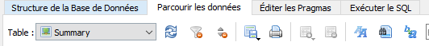

# Shodan2DB
🔌 Shodan export to SQLite database.

## Purpose

The purpose of this tool is to parse Shodan export files and put them into a SQLite database.

The exports bypass the restriction on "**vuln**" and "**tag**" tags, which are only available with Small Business, Corporate or Enterprise accounts. These data are included present in Shodan exports.

Once in the database, it's easier to analyze the data and extract a list of machines with CVEs.

## Requirements
```
pip install -r requirements.txt
```

## Usage and options

```
Usage: main.py [OPTIONS]

Options:
  --version            Show the version and exit.
  -v, --verbose        Verbose mode
  -d, --database TEXT  Database name  [default: shodan.db]
  -i, --input TEXT     Json export file from Shodan  [required]
  -h, --help           Show this message and exit.
```

## Quickstart
Do a search and click on "**Download Results**".


Select the number of results to download.


Download your results.


Then import the results into the database using the command :
```
main.py -i <json_file>
```

**Tags** and **vulns** are visible directly in the **Summary** table.


