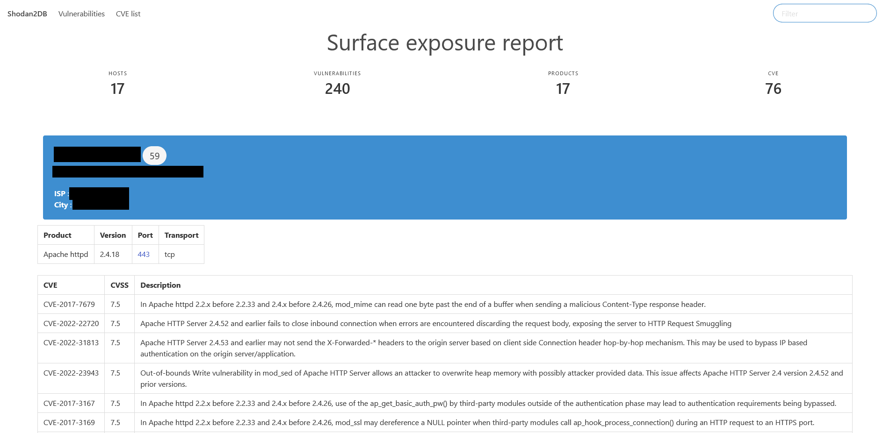

[](https://github.com/atao/Shodan2DB/actions/workflows/main.yml)
# Shodan2DB
🔌 Shodan export to SQLite database and generate an HTML report.

## Purpose

The purpose of this tool is to parse Shodan export files and put them into a SQLite database.

Exports bypass the restriction on "**vuln**" and "**tag**" tags, which are only available with Small Business, Corporate or Enterprise accounts. These data are included present in Shodan exports.

Once in the database, it's easier to analyze the data and extract a list of machines with CVEs.

Generate a report of found CVEs with HTML template.
Customize the report in `templates/` folder using jinja2 and Bulma CSS.

## Requirements
```
pip install -r requirements.txt
```

## Usage and options

```
Usage: shodan2db.py [OPTIONS] COMMAND [ARGS]...

Options:
  --help  Show this message and exit.

Commands:
  export  Generate an HTML report from the data in the database.
  parse   Parse the Shodan JSON export file and store data in the database.
```
- *Command parse*
```
Usage: shodan2db.py parse [OPTIONS]

  Parse the Shodan JSON export file and store data in the database.

Options:
  -i, --input-file PATH  JSON export file from Shodan.  [required]
  -d, --database TEXT    Database name.  [required]
  -v, --verbose          Verbose mode.
  -h, --help             Show this message and exit.
```
- *Command export*
```
Usage: shodan2db.py export [OPTIONS]

  Generate an HTML report from the data in the database.

Options:
  -d, --database PATH     Path to the SQLite database file.  [required]
  -o, --report-file PATH  Output path for the HTML report file.  [default:
                          shodan.html]
  -v, --verbose           Verbose mode.
  -h, --help              Show this message and exit.
```

## Quickstart
Do a search and click on "**Download Results**".


Select the number of results to download.


Download your results.


Then import the results into the database using the command :
```
python .\shodan2db.py parse -i .\example_shodan.json -d .\example_database.db -v
python .\shodan2db.py export -d .\example_database.db -d .\example_report.html -v
```

**Tags** and **vulns** are visible directly in the **Summary** table.


Example of report :



## Templates

Customize the report template in [templates/report.html](templates/report.html)

The current one uses [Bulma CSS](https://bulma.io/).

## Development

Use Shodan2DB as python class

```python
import shodan2db as sh

sh.Shodan2DB.export(verbose=True, exportfile="test.html", database="test.db")
```