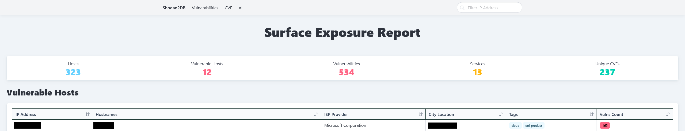
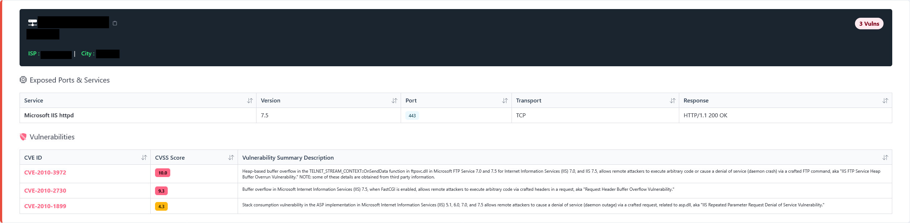
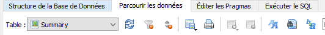

# Shodan2DB
This tool generates a report on the attack surface exposed on the internet based on Shodan exports.

Shodan exports contain “vulns” tags and other tags that are not directly available online or through subscriptions such as Small Business, Corporate, or Enterprise.
With this tool, they become accessible, enabling an in-depth analysis of vulnerabilities and helping to prepare a remediation plan.

Reports can be customized in [templates/report.html](templates/report.html) using Jinja2.

The provided template uses Bulma CSS.

## Features

- **Attack surface inventory** covering exposed hosts, services, ports, and technologies.
- **Vulnerable host inventory** with vulnerability counts and affected services.
- **CVE information** including CVSS scores, verification status, and vulnerability summaries.
- **Consolidated CVE statistics** to highlight recurring and widespread vulnerabilities.
- **Exposure analysis** to support risk-based remediation prioritization.
- **Shodan export support** for JSON and compressed JSON.GZ files.
- **Local SQLite storage** for services, network metadata, tags, and vulnerabilities.
- **Vulnerability deduplication** based on IP address and CVE pairs.
- **HTML report generation** with sortable tables and client-side search.
- **Customizable reports** using a Jinja2 template.

## Requirements

- Python 3.8 or later.
- An export obtained through Shodan’s supported export features.

Install the dependencies:

```bash
python -m pip install -r requirements.txt
```

## Commands

```bash
Usage: shodan2db.py [OPTIONS] COMMAND [ARGS]...

  Shodan2DB CLI tool for parsing Shodan JSON exports and generating HTML
  reports.

Options:
  --help  Show this message and exit.

Commands:
  export  Generate an HTML report from the data in the database.
  parse   Parse exported file from Shodan and store the data in a SQLite database.
```

### Command : parse

```bash
Usage: shodan2db.py parse [OPTIONS]

  Parse exported file from Shodan and store the data in a SQLite database.

Options:
  -i, --input-file FILE  JSON or JSON.GZ export file from Shodan.  [required]
  -d, --database FILE    Target database name or path.  [required]
  -v, --verbose          Verbose mode.
  -h, --help             Show this message and exit.
```

### Command : export

```bash
Usage: shodan2db.py export [OPTIONS]

  Generate an HTML report from the data in the database.

Options:
  -d, --database FILE       Path to the SQLite database file.  [required]
  -o, --report-file FILE    Output path for the HTML report file.  [default:
                            shodan.html]
  -t, --template-file FILE  Path to the Jinja2 template file.  [default:
                            templates/report.html]
  -v, --verbose             Verbose mode.
  -h, --help                Show this message and exit.
```

## Quickstart

1. Query Shodan via the web interface and click on **"Download Results"**.


2. Select the number of results to download.


3. Download your results.


4. Import your results and compile your threat report utilizing the CLI sequences:

```bash
# Step 1: Parse and seed your structured SQLite layer
python shodan2db.py parse -i ./example_shodan.json -d ./example_database.db -v

# Step 2: Extract analytics and output your HTML dashboard
python shodan2db.py export -d ./example_database.db -o ./example_report.html -v
```

5. See report file :

- Dataset summary

  

- Host details

  

**Tags** and **vulns** are visible directly in the **Summary** table.



## Database Architecture

Upon initialization, the tool optimizes SQLite pragmas and automatically structures the underlying relational objects:

- **`services`**: Houses core operational network service logs, banners, localisation, ISP allocations, and metadata.
- **`vulnerabilities`**: Stores indexed granular mappings of CVE IDs alongside their verified CVSS scores and threat summary descriptions.
- **`Summary` (View)**: An internal prioritized virtual evaluation layer sorting network entities by physical exposure risk (`nbvulns DESC`).

## Templates Customization

The presentation architecture is entirely modular. You can seamlessly customize the structural layout or interface themes inside [templates/report.html](templates/report.html). 

The default layout leverages **Bulma CSS** to render high-contrast, professional cybersecurity matrices with custom conditional coloring for CVSS threat scales.

## Development

You can import `Shodan2DB` directly into third-party automated playbooks or continuous integration loops as a native Python class:

```python
from shodan2db import Shodan2DB

# Programmatically trigger parsing and reporting
Shodan2DB.prepare_database(verbose=True, database="production_audit")
Shodan2DB.parser(verbose=True, inputfile="raw_shodan.json", database="production_audit")
Shodan2DB.export(verbose=True, exportfile="exposure.html", database="production_audit", template_file="templates/report.html")
```